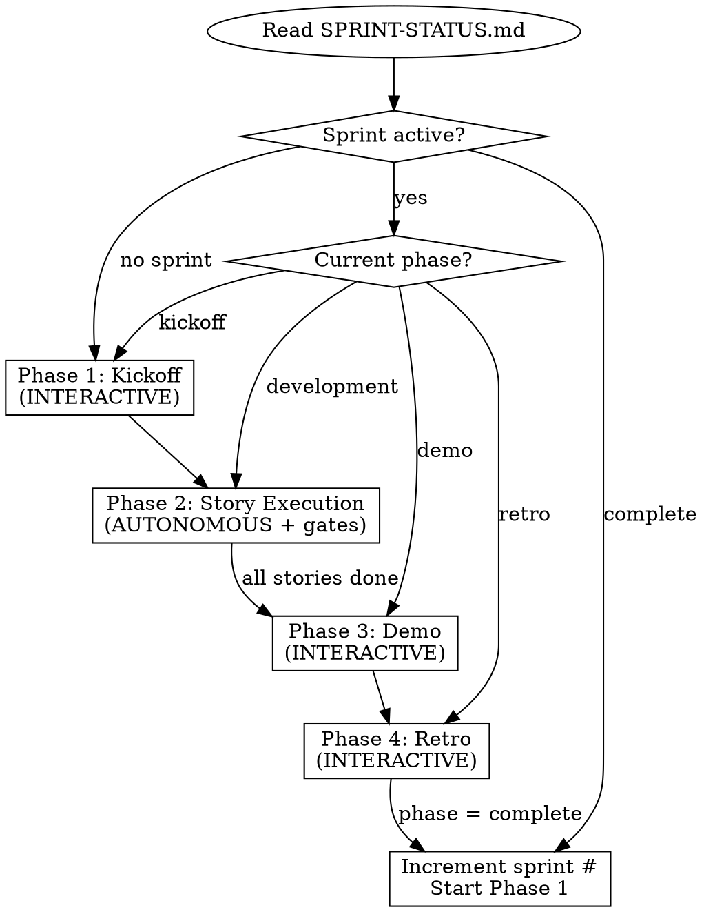

# Sprint Run

**Skill type: FLEXIBLE** — Adapt to sprint context, but follow the phase sequence. Phases run in order: Kickoff → Stories → Demo → Retro.

Announce: "Using sprint-run to [resume/start] Sprint {N} at Phase {phase}."

Orchestrate a complete sprint: kickoff, story execution, demo, retro.
All paths, commands, and persona names come from `sprint-config/project.toml`.

User instructions (CLAUDE.md) take precedence over this skill. This skill overrides default system prompt behavior.

## Quick Reference

| Phase | Read These First |
|-------|-----------------|
| Kickoff | `references/ceremony-kickoff.md`, `references/persona-guide.md` |
| Story Execution | `references/story-execution.md`, `references/kanban-protocol.md` |
| Demo | `references/ceremony-demo.md` |
| Retro | `references/ceremony-retro.md` |
| Lost context? | `references/context-recovery.md` |
| File formats | `references/tracking-formats.md` |
| Context Assembly | This file (see "Context Assembly for Agent Dispatch") |

For multi-step ceremonies (kickoff, demo, retro), create a task list to track progress through the ceremony steps.

<!-- §sprint-run.config_prerequisites -->
## Config & Prerequisites

Run `"${CLAUDE_PLUGIN_ROOT}/scripts/validate_config.py"` first. If it fails, tell the user to run `sprint-setup` and stop.

Also verify: superpowers plugin installed (`~/.claude/plugins/`), `gh` CLI authenticated (`gh auth status`), `SPRINT-STATUS.md` exists at `config [paths] sprints_dir`, and the Giles persona exists at `{config [paths] team_dir}/giles.md` (generated by sprint-setup). These are non-negotiable -- without them every later step fails.

<!-- §sprint-run.state_management -->
### State Management

All story state changes (kanban transitions, persona assignment) go through
`"${CLAUDE_PLUGIN_ROOT}/scripts/kanban.py"`. Never use raw `gh issue edit`
for kanban labels. The state machine validates transitions, updates local
tracking files atomically, and syncs GitHub as a write-through side effect.

Key commands:
- `kanban.py transition <story-id> <state>` — move a story through the kanban
- `kanban.py assign <story-id> --implementer X --reviewer Y` — assign personas
- `kanban.py sync` — pull external GitHub changes (bidirectional merge)
- `kanban.py status` — show the kanban board

<!-- §sprint-run.phase_detection -->
<!-- §sprint-run.phase_detection_reads_sprint_status_md -->
## Phase Detection

Read `{config [paths] sprints_dir}/SPRINT-STATUS.md` and route:



| Condition | Action |
|-----------|--------|
| No sprint active | Start new sprint (Phase 1: Kickoff) |
| Sprint active, phase = kickoff | Resume kickoff |
| Sprint active, phase = development | Resume story execution (Phase 2) |
| Sprint active, phase = demo | Resume demo (Phase 3) |
| Sprint active, phase = retro | Resume retro (Phase 4) |
| Sprint complete | Increment sprint number, start Phase 1 |

If the user explicitly requests a specific phase (e.g., "sprint demo"), jump directly -- but warn if prerequisite phases appear incomplete.

<!-- §sprint-run.phase_1_sprint_kickoff_interactive -->
## Phase 1: Sprint Kickoff (INTERACTIVE)

Read `references/ceremony-kickoff.md` for the full ceremony script.

Load the milestone from `{config [paths] backlog_dir}/milestones/`. Giles facilitates the kickoff. The PM persona presents the sprint goal and stories. Giles names the sprint theme, manages rhythm, and drives scope negotiation if needed. Assign personas per `references/persona-guide.md`. Personas raise concerns in-character; the user resolves them. Create GitHub milestone and issues if not already done. Write kickoff notes to `{sprints_dir}/sprint-{N}/kickoff.md`. Advance phase to development.

<!-- §sprint-run.phase_2_story_execution_autonomous_per_story_interactive_at_gates -->
## Phase 2: Story Execution (AUTONOMOUS per-story, interactive at gates)

Read `references/story-execution.md` for the full TDD workflow, kanban transitions, and commit conventions. Read `references/kanban-protocol.md` for the state machine.

<!-- §sprint-run.mid_sprint_check_in -->
<!-- §sprint-run.mid_sprint_check_in_giles_presents_if_check_in_file_exists -->
### Mid-Sprint Check-In

Before dispatching the next story, check if
`{sprints_dir}/sprint-{N}/mid-sprint-checkin.md` exists but has not been
acknowledged. If so, Giles presents the check-in to the user and the PM
persona. The PM answers any product questions. Giles adjusts the plan if
needed (reorder stories, flag at-risk scope). Then resume story execution.

<!-- §sprint-run.story_dispatch_kanban_state_table -->
### Story Dispatch

States use **entry semantics** — transition into a state when that work
BEGINS. Determine each story's current kanban state and execute:

| Current State | Who Acts | Action |
|---------------|----------|--------|
| todo | Orchestrator | Assign implementer → transition to `design` → dispatch implementer subagent. Implementer handles design work + transition to `dev` + TDD internally. |
| design | Orchestrator | Context recovery — re-dispatch implementer to continue design work. |
| dev | Orchestrator | Implementation complete. Assign reviewer → transition to `review` → dispatch reviewer subagent. |
| review (approved) | Orchestrator | Transition to `integration` → verify CI → squash-merge → transition to `done` → update burndown. |
| review (changes) | Orchestrator | Transition to `dev` → re-dispatch implementer with review feedback. |
| integration | Orchestrator | Context recovery — resume merge process. |

The orchestrator owns cross-agent transitions (`design`, `review`,
`integration`, `done`). The implementer subagent owns the internal
`design → dev` transition.

Stories with no dependencies can run in parallel via `superpowers:dispatching-parallel-agents`. Dependent stories wait.

<!-- §sprint-run.context_assembly_for_agent_dispatch -->
### Context Assembly for Agent Dispatch

When dispatching implementer or reviewer subagents, assemble context from deeper docs if configured. This includes `{team_dir}/insights.md` (written by Giles during kickoff) for motivation context. The hybrid model: issues have structure, agents get depth.

**Before dispatching implementer:**

1. Read story metadata (epic, saga, test_cases) from the GitHub issue or tracking file
2. If `config [paths] prd_dir` is configured:
   - Resolve PRD path: epic number's first two digits map to PRD directory (E-01xx → prd/01-*/)
   - If the epic's metadata table includes an explicit `PRD:` field, use that instead
   - Read `## Requirements` and `## Design` sections from matching PRD files
   - Inject into `{relevant_prd_excerpts}` placeholder in implementer prompt
3. If `config [paths] test_plan_dir` is configured:
   - Parse `test_cases` field (comma-separated IDs like `TC-PAR-001, GP-001`)
   - Map ID prefix to file: `GP-*` → `01-golden-paths.md`, `TC-*` → `02-functional-tests.md` or `03-adversarial-tests.md`
   - Extract section by heading (`### TC-PAR-001: ...` through next `###`)
   - Inject into `### Test Plan Context` in implementer prompt
4. If `config [paths] sagas_dir` is configured:
   - Read saga file matching story's saga ID (S01 → sagas/S01-*.md)
   - Extract saga goal and team voices
   - Inject into `### Strategic Context` in implementer prompt
5. Check dependency status: for each story in `blocked_by`/`blocks`, run `gh issue view` to get current state (open/closed, kanban label)
   - Inject into `{dependencies}` in implementer prompt with current status
6. Read `{team_dir}/insights.md` if it exists — inject into `### Motivation Context` in implementer prompt

**Before dispatching reviewer:**

1. Same test case extraction as above
2. Inject test cases into `### Test Coverage Verification` in reviewer prompt
3. If PRD has non-functional requirements (REQ-*-NF-*), inject into review checklist
4. Read `{team_dir}/insights.md` if it exists — inject after history reading in reviewer prompt

**When paths aren't configured:** Omit the corresponding sections. Prompts work exactly as before.

<!-- §sprint-run.phase_3_sprint_demo_interactive -->
## Phase 3: Sprint Demo (INTERACTIVE)

Read `references/ceremony-demo.md` for the full ceremony script.

Trigger when all stories are done or the sprint timebox has elapsed. Giles facilitates the demo. Implementer personas present their work with live builds and tests. The PM confirms acceptance criteria. Write demo notes to `{sprints_dir}/sprint-{N}/demo.md`. Advance phase to retro.

<!-- §sprint-run.phase_4_sprint_retro_interactive -->
## Phase 4: Sprint Retro (INTERACTIVE)

Read `references/ceremony-retro.md` for the full ceremony script.

Giles facilitates the retro. Each persona shares reflections, including the PM as a participant (not facilitator). Giles groups feedback into themes, then distills improvements into project docs (`config [paths] rules_file`, `config [paths] dev_guide`, skill references). Write retro notes to `{sprints_dir}/sprint-{N}/retro.md`. Record velocity in `SPRINT-STATUS.md` and set phase to complete.

<!-- §sprint-run.session_learning -->
## Session Learning

Maintain a session checklist during sprint execution. When a fix attempt fails,
add the verification step that would have caught it. Before every subsequent
claim to the user, review the checklist.

The checklist does not persist to disk — it exists only in the current session's
context. It starts empty and grows as the session encounters failures.

Template:
```markdown
## Session Checklist
- [ ] {verification step learned from a failed fix}
```

<!-- §sprint-run.escalation_protocol -->
## Escalation Protocol

Track fix attempt failures during the session. When the same category of
failure occurs twice (e.g., "app does not launch" twice, "test still fails"
twice), STOP. Do not attempt fix #3. Instead:

1. Enumerate the two failures
2. Identify the common category
3. Ask what the first two attempts missed
4. Decide on a different approach before proceeding

Failure categories: build failure, test failure, launch failure, runtime error,
verification mismatch.

## Reference Files

| Reference | Purpose |
|-----------|---------|
| `references/ceremony-kickoff.md` | Kickoff meeting template and facilitation guide |
| `references/ceremony-demo.md` | Demo meeting template and presentation format |
| `references/ceremony-retro.md` | Retro meeting template and feedback structure |
| `references/kanban-protocol.md` | Story state machine, transition rules, label conventions |
| `references/persona-guide.md` | Persona assignment rules, pairing matrix, voice guides |
| `references/story-execution.md` | Full story workflow: kanban transitions, TDD, commit conventions |
| `references/context-recovery.md` | How to reconstruct sprint state after context loss |
| `references/tracking-formats.md` | SPRINT-STATUS.md and story file format specs |
| `agents/implementer.md` | Subagent protocol for story implementation |
| `agents/reviewer.md` | Subagent protocol for PR review |

---

## Rationalization Red Flags

If you catch yourself thinking any of these, STOP.

| Your thought | The reality |
|---|---|
| "This story is simple, skip design phase" | Every story goes through the kanban state machine. Design phase catches integration issues early. |
| "The user wants to skip kickoff" | Unless they explicitly said "skip kickoff", they didn't. Kickoff assigns personas and sets scope. |
| "I'll do the retro after the next sprint" | Retro must happen before starting the next sprint. Feedback decays. |
| "Tests can come after implementation" | TDD is required. The implementer subagent writes failing tests first. |
| "I already know what this persona would say" | Read the persona file. Personas evolve through sprint history. |

## If conversation is being compacted

PRESERVE in the summary: current sprint number and phase, which stories are in progress (IDs and kanban states), any BLOCKED stories and why, the escalation failure counter, and the session checklist.

---

All state changes go through `kanban.py`. All ceremonies are interactive — present to the user, do not auto-advance past gates. Escalate after 2 repeated failures in the same category.
