# Story Execution Reference

Stories flow through six kanban states. Each state represents the work
currently in progress — transitions fire on **entry**, when that type of
work BEGINS. The board answers "what is this story doing right now?"

See `kanban-protocol.md` for the full state machine and transition rules.
See `persona-guide.md` for persona assignment and pairing rules.

```dot
digraph story_flow {
  rankdir=LR
  node [shape=box]
  todo [label="TO-DO"]
  design [label="DESIGN\n(branch, draft PR, notes)"]
  dev [label="DEV\n(TDD, push, mark ready)"]
  review [label="REVIEW\n(persona review)"]
  integration [label="INTEGRATION\n(CI, merge, close)"]
  done [label="DONE"]
  todo -> design [label="implementer\nassigned"]
  design -> dev [label="design ready\n(branch+PR exist)"]
  dev -> review [label="dev complete\nreviewer assigned"]
  review -> dev [label="changes\nrequested"]
  review -> integration [label="review\napproved"]
  integration -> done [label="merged\nissue closed"]
}
```



### Transition ownership

The **orchestrator** (sprint-run) owns cross-agent transitions: entering
`design`, `review`, `integration`, and `done`. The **implementer** subagent
owns the internal transition from `design` to `dev` (within its own scope).

---

<!-- §story-execution.to_do_design -->
## TO-DO --> DESIGN

The orchestrator assigns the implementer and enters the `design` state.
The implementer then does the design work IN this state.

1. Assign the implementer persona:
   ```bash
   python "${CLAUDE_PLUGIN_ROOT}/scripts/kanban.py" assign {story_id} --implementer {name}
   ```
2. Enter design (transition fires on entry — design work begins now):
   ```bash
   python "${CLAUDE_PLUGIN_ROOT}/scripts/kanban.py" transition {story_id} design
   ```
3. Dispatch the implementer subagent. Read `agents/implementer.md`
   for the full agent protocol. The implementer's persona file (from
   `{config [paths] team_dir}/`) provides voice, domain focus, and
   review style.

**Work done IN the design state** (by the implementer subagent):
- Create branch using the pattern from
  `config [conventions] branch_pattern` (e.g., `sprint-{N}/US-XXXX-slug`).
  ```bash
  git checkout -b {branch_name} {base_branch}
  git push -u origin {branch_name}
  ```
- Open a **draft PR** with full context in the description:
  - Story ID, title, acceptance criteria (copied in full)
  - Relevant PRD excerpts (so the reviewer can work entirely from the
    PR -- no external doc lookup needed)
  - Design decisions and rationale
  - Persona header: who implements, who reviews
  - Links to related stories/PRDs (for reference, not required reading)
  ```bash
  gh pr create --draft --base {base_branch} --head {branch_name} \
    --title "{story_id}: {story_title}" \
    --body "{pr_description}"
  ```
- Apply PR labels (persona, sprint, saga, priority):
  ```bash
  gh pr edit {pr_number} --add-label "persona:{persona},sprint:{N},saga:{saga},priority:{pri}"
  ```
- Set tracking fields (these are entry guards for the next state):
  ```bash
  python "${CLAUDE_PLUGIN_ROOT}/scripts/kanban.py" update {story_id} --pr-number {pr_number} --branch {branch_name}
  ```
- Write design notes in
  `{sprints_dir}/sprint-{N}/stories/US-XXXX-slug.md`.

The PR description carries full context — the reviewer works entirely from the PR description and diff.

<!-- §story-execution.commit_convention -->
### Commit Convention

All commits MUST use the conventional commit wrapper:

```bash
python "${CLAUDE_PLUGIN_ROOT}/scripts/commit.py" "feat(module): description"
```

Use `commit.py` exclusively for all commits — it validates message format and
checks atomicity. See `"${CLAUDE_PLUGIN_ROOT}/scripts/commit.py" --help` for flags.

---

<!-- §story-execution.design_development_tdd_via_superpowers -->
## DESIGN --> DEVELOPMENT

The implementer transitions to `dev` after design deliverables are ready.
The `dev` entry guard verifies that `branch` and `pr_number` exist — these
are the design phase's deliverables.

1. Enter dev (transition fires on entry — TDD begins now):
   ```bash
   python "${CLAUDE_PLUGIN_ROOT}/scripts/kanban.py" transition {story_id} dev
   ```

**Work done IN the dev state** (by the implementer subagent):
1. Invoke `superpowers:test-driven-development` -- write failing tests
   first, then implement until tests pass.
2. If `config [paths] cheatsheet` or `config [paths] architecture`
   are defined, update those progressive disclosure docs in lockstep
   with code changes. Code without updated docs is incomplete work.
3. Push commits to the branch. Mark PR as ready for review.
   ```bash
   git push origin {branch_name}
   gh pr ready {pr_number}
   ```

When dev work is complete, the implementer subagent exits. The
orchestrator then handles the transition to `review`.

---

<!-- §story-execution.development_review_pr_ready_dispatch_reviewer -->
## DEVELOPMENT --> REVIEW

The orchestrator assigns the reviewer and enters the `review` state.
The reviewer subagent is then dispatched.

1. Assign the reviewer persona:
   ```bash
   python "${CLAUDE_PLUGIN_ROOT}/scripts/kanban.py" assign {story_id} --reviewer {name}
   ```
2. Enter review (transition fires on entry — review begins now):
   ```bash
   python "${CLAUDE_PLUGIN_ROOT}/scripts/kanban.py" transition {story_id} review
   ```
3. Dispatch the reviewer as a subagent. Read `agents/reviewer.md` for the
   full agent protocol. The reviewer's persona file (from
   `{config [paths] team_dir}/`) provides voice and review perspective.

**Work done IN the review state** (by the reviewer subagent):
1. Reviewer is a **different persona** than the implementer. Read
   `persona-guide.md` for the pairing rules.
2. Reviewer posts a GitHub PR review with a persona header identifying
   who they are and what perspective they bring.
3. Review is conducted entirely from the PR description + diff. This
   validates that the PR description is actually sufficient. If the
   reviewer needs to read external docs to understand the change, that
   is a defect in the PR description, not a defect in the reviewer.
4. If approved: proceed to integration.
5. If changes requested: transition back to `dev`, implementer addresses
   feedback, then re-requests review. This loop repeats until approval.
   ```bash
   python "${CLAUDE_PLUGIN_ROOT}/scripts/kanban.py" transition {story_id} dev
   ```

<!-- §story-execution.pair_review_high_risk_stories -->
### Pair Review (High-Risk Stories)

When a story meets BOTH of these criteria, dispatch two reviewer subagents:
1. Story points >= 5
2. Story touches files owned by multiple personas (check domain keywords
   in team INDEX.md against the files changed in the PR)

Each reviewer brings their domain expertise. Dispatch as separate subagents
so context costs are isolated.

The implementer addresses both reviews. If the reviewers disagree, the
implementer reconciles — both perspectives are valid, and the implementer
is closest to the code. If reconciliation isn't possible, escalate to the
user.

Pair review produces two GitHub reviews on the same PR. Both must approve
before proceeding to integration.

---

<!-- §story-execution.review_integration_ci_green_squash_merge -->
## REVIEW --> INTEGRATION

After the reviewer approves, the orchestrator enters the `integration`
state. CI verification, merge, and issue closure happen IN this state.

1. Enter integration (transition fires on entry — merge process begins):
   ```bash
   python "${CLAUDE_PLUGIN_ROOT}/scripts/kanban.py" transition {story_id} integration
   ```

**Work done IN the integration state** (by the orchestrator):
2. Confirm CI is green:
   ```bash
   gh pr checks {pr_number} --watch
   ```
3. Invoke `superpowers:verification-before-completion` to run the
   project's verification suite.
4. Squash-merge the PR:
   ```bash
   gh pr merge {pr_number} --squash --delete-branch
   ```

---

<!-- §story-execution.integration_done -->
## INTEGRATION --> DONE

After the merge is confirmed, transition to the terminal state.

1. Close the story:
   ```bash
   python "${CLAUDE_PLUGIN_ROOT}/scripts/kanban.py" transition {story_id} done
   ```
2. Update burndown:
   ```bash
   python "${CLAUDE_PLUGIN_ROOT}/skills/sprint-run/scripts/update_burndown.py" {sprint_number}
   ```
3. Run sync to record completion date from GitHub's `closedAt` field:
   ```bash
   python "${CLAUDE_PLUGIN_ROOT}/scripts/kanban.py" sync
   ```
4. Update `SPRINT-STATUS.md` with the completed story.

---

<!-- §story-execution.parallel_dispatch_for_independent_stories -->
## Parallel Dispatch

Check the story dependency graph before dispatching. Stories with no
dependencies on in-progress work can run simultaneously using
`superpowers:dispatching-parallel-agents`.

Stories that depend on an in-progress story wait. This is enforced
rather than advisory because merging dependent work out of order creates
integration nightmares that cost more time than the parallelism saves.
