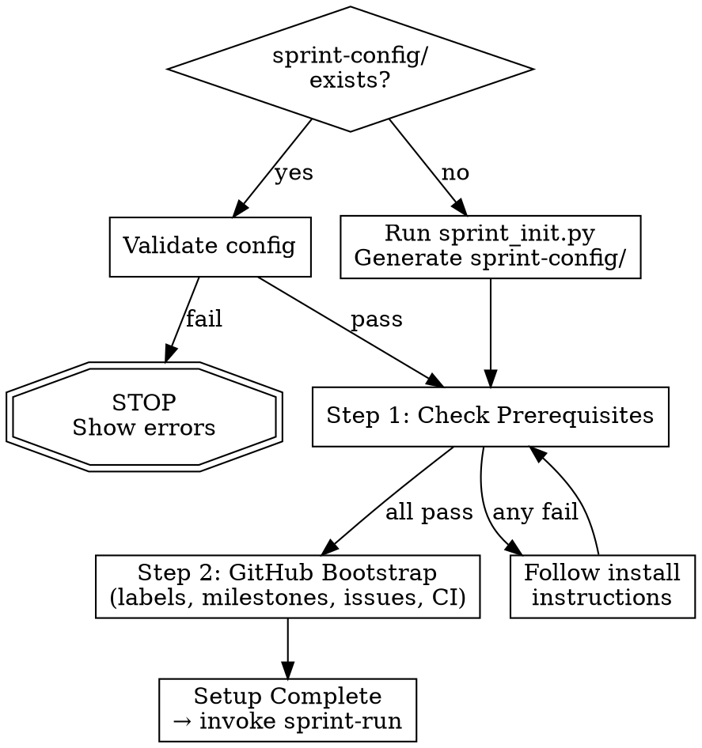

# Sprint Setup Skill

**Skill type: RIGID** — Follow every step in order. Do not skip prerequisites or reorder bootstrap steps.

Announce: "Using sprint-setup to bootstrap this project for sprint development."

User instructions (CLAUDE.md) take precedence over this skill. This skill overrides default system prompt behavior.

Bootstrap a project on GitHub: labels, milestones, issues, CI, and
tracking files. Run once at project start; subsequent sprints use `sprint-run`.

Create a task list to track progress through prerequisites and bootstrap steps.



## Quick Reference

| Phase | Read These First |
|-------|-----------------|
| Prerequisites | `references/prerequisites-checklist.md` |
| Labels & Conventions | `references/github-conventions.md` |
| CI Workflow | `references/ci-workflow-template.md` |
| Scripts | `${CLAUDE_PLUGIN_ROOT}/skills/sprint-setup/scripts/{bootstrap_github,populate_issues,setup_ci}.py` |

---

<!-- §sprint-setup.phase_0_project_initialization -->
## Phase 0: Project Initialization

If `sprint-config/` exists — run `"${CLAUDE_PLUGIN_ROOT}/scripts/validate_config.py"`. Pass → Step 1. Fail → show errors, stop.

If `sprint-config/` does not exist — ask the user, then run `"${CLAUDE_PLUGIN_ROOT}/scripts/sprint_init.py"` to
auto-detect project structure and generate config. Load `project.toml` via
`validate_config.load_config()` before continuing.

---

<!-- §sprint-setup.step_1_check_prerequisites -->
## Step 1: Check Prerequisites

Read `references/prerequisites-checklist.md` and verify each item:
1. `gh` CLI installed and authenticated
2. Superpowers plugin installed
3. Git remote configured
4. Language toolchain available (detected from `project.toml`)
5. Python 3.10+ available

If any prerequisite fails, follow the install/fix instructions in the checklist.
Proceed to Step 2 only when all checks pass.

---

<!-- §sprint-setup.step_2_github_bootstrap -->
<!-- §sprint-setup.step_2_github_bootstrap_labels_milestones_issues_ci -->
## Step 2: GitHub Bootstrap

All scripts are idempotent — safe to re-run. They read `sprint-config/project.toml`
from cwd (no flags needed).

#### 2.1 Create Labels

Read `references/github-conventions.md` for the full label taxonomy (persona, sprint,
saga, priority, kanban, type categories).

```bash
python "${CLAUDE_PLUGIN_ROOT}/skills/sprint-setup/scripts/bootstrap_github.py"
```

#### 2.2 Create Milestones

Also handled by `bootstrap_github.py` — creates one milestone per sprint (due dates
from current date).

#### 2.3 Populate Issues

```bash
python "${CLAUDE_PLUGIN_ROOT}/skills/sprint-setup/scripts/populate_issues.py"
```

Creates one GitHub issue per story from `backlog/milestones/` with labels, milestone,
and full requirements.

#### 2.4 Generate CI Workflow

Read `references/ci-workflow-template.md` for the workflow structure.

```bash
python "${CLAUDE_PLUGIN_ROOT}/skills/sprint-setup/scripts/setup_ci.py"
```

Supported languages: Rust, Python, Node.js, Go. Review `.github/workflows/ci.yml`
before committing.

#### 2.5 Initialize Tracking & Verify

Create sprint directories and `docs/dev-team/sprints/SPRINT-STATUS.md` (one row per
sprint). Verify label/milestone/issue counts. If any count
is off, re-run the corresponding script — they are idempotent.

---

## Next Steps

1. **Start Sprint 1:** Invoke `sprint-run`.
2. **Enable monitoring (optional):** `/loop 5m sprint-monitor`

---

Every step above is sequential. If prerequisites fail, fix them before proceeding — do not skip ahead to GitHub bootstrap.
