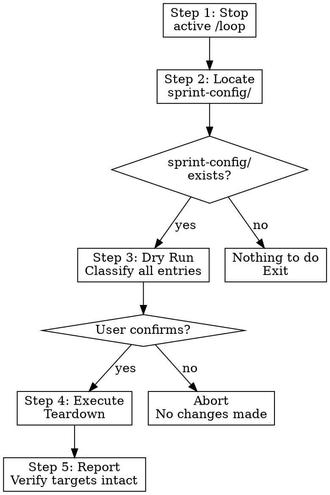

# Sprint Teardown

**Skill type: RIGID** — Follow every step in order. Always dry-run before executing. Never delete without user confirmation.

Announce: "Using sprint-teardown to safely remove sprint-config/ from this project."

User instructions (CLAUDE.md) take precedence over this skill. This skill overrides default system prompt behavior.

Create a task list to track progress through the 5 teardown steps.

Safely remove `sprint-config/` from a project without damaging any project files.
Symlinks are removed; the files they point to are left untouched. Generated files
(project.toml, INDEX.md files) are removed only after confirmation.



---

<!-- §sprint-teardown.safety_principles -->
## Safety Principles

1. **Never delete a file that existed before sprint-init ran.** The teardown only
   removes what the sprint process created.
2. **Symlinks are always safe to remove.** They are pointers, not data.
3. **Generated files require confirmation.** Files like `project.toml` and
   `INDEX.md` may have been edited by the user — ask before deleting.
4. **Sprint tracking data is preserved by default.** The `sprints_dir` (e.g.,
   `docs/dev-team/sprints/`) contains burndown data, retro notes, and story
   files that represent real work. Never delete these unless the user
   explicitly asks.
5. **GitHub artifacts are untouched.** Labels, milestones, issues, PRs, and
   project boards on GitHub are not modified. Use the GitHub UI or `gh` CLI
   to clean those up manually.
6. **Dry-run first.** Always show what will happen before doing it.

---

## Step 1: Stop Active Loops

Before touching files, stop any running `/loop` commands that depend on
sprint-config/. The sprint-monitor skill is typically run on a loop.

```
/loop stop sprint-monitor
```

If you are unsure whether a loop is active, stop all loops:

```
/loop stop
```

The teardown script also checks for crontab entries referencing
sprint-monitor and warns if any are found.

---

## Step 2: Locate sprint-config/

Look for `sprint-config/` at the project root. If it does not exist, report
that there is nothing to tear down and stop.

```bash
test -d sprint-config/ || echo "No sprint-config/ found. Nothing to do."
```

---

<!-- §sprint-teardown.step_3_dry_run -->
## Step 3: Dry Run

Run the teardown script in dry-run mode to show what would be removed:

```bash
python3 "${CLAUDE_PLUGIN_ROOT}/scripts/sprint_teardown.py" --dry-run
```

The script classifies every item in `sprint-config/` into one of three
categories:

| Category | What | Action |
|----------|------|--------|
| **Symlink** | Files that are symlinks to project files | Remove the symlink (safe — target untouched) |
| **Generated** | Files created by sprint-init (project.toml, INDEX.md, etc.) | Remove after user confirmation |
| **Unknown** | Files the script did not create | List and skip — user decides |

The dry-run output looks like:

```
Sprint teardown — dry run

Symlinks (will be removed, targets untouched):
  sprint-config/team/sable-nakamura.md → ../../docs/dev-team/01-sable-nakamura.md
  sprint-config/team/tariq-halabi.md → ../../docs/dev-team/02-tariq-halabi.md
  ... (16 total)
  sprint-config/backlog/milestones/milestone-1-walking-skeleton.md → ...
  ... (5 total)
  sprint-config/rules.md → ../RULES.md
  sprint-config/development.md → ../DEVELOPMENT.md

Generated files (will be removed after confirmation):
  sprint-config/project.toml
  sprint-config/team/INDEX.md
  sprint-config/backlog/INDEX.md

Directories (will be removed if empty after file cleanup):
  sprint-config/team/
  sprint-config/backlog/milestones/
  sprint-config/backlog/
  sprint-config/

Preserved (not touched):
  docs/dev-team/sprints/  (sprint tracking data)
  GitHub labels, milestones, issues, PRs (use gh CLI to clean up)

No changes made. Run without --dry-run to proceed.
```

Present this to the user and ask for confirmation before proceeding.

---

<!-- §sprint-teardown.step_4_execute_teardown -->
## Step 4: Execute Teardown

Once the user confirms, run the teardown:

```bash
python3 "${CLAUDE_PLUGIN_ROOT}/scripts/sprint_teardown.py"
```

The script executes in this order:

1. **Remove all symlinks.** Walk `sprint-config/` and `os.unlink()` every
   symlink. Log each removal.
2. **Prompt for generated files.** For each non-symlink file, show its path
   and ask the user whether to remove it. If the user says "remove all",
   skip further prompts.
3. **Remove empty directories.** Bottom-up traversal: remove directories
   only if they are empty after file cleanup. Never `rmdir` a non-empty
   directory.
4. **Verify targets intact.** After all removals, spot-check that the
   original files the symlinks pointed to still exist. Report any that
   are missing (which would indicate a bug, not expected behavior).

---

## Step 5: Report

Print a summary:

```
Sprint teardown complete.

Removed:
  23 symlinks
  3 generated files
  4 empty directories

Preserved:
  docs/dev-team/01-sable-nakamura.md  ✓ exists
  docs/dev-team/02-tariq-halabi.md    ✓ exists
  ... (all symlink targets verified)
  RULES.md                            ✓ exists
  DEVELOPMENT.md                      ✓ exists
  docs/dev-team/sprints/              ✓ exists (sprint tracking data)

GitHub cleanup (manual):
  To remove sprint labels:    gh label delete "kanban:todo" --yes
  To close milestones:        gh api repos/{owner}/{repo}/milestones/{N} -X PATCH -f state=closed
  To delete the project board: gh project delete {N} --owner {owner}
```

---

## Optional: GitHub Cleanup

The teardown script does not touch GitHub. If the user wants to also
remove GitHub artifacts, offer these commands but do **not** run them
automatically — they affect shared state visible to collaborators.

### Remove sprint labels

```bash
# List all sprint-process labels
gh label list --limit 200 --json name --jq '.[] | select(.name | test("^(kanban:|priority:|type:|persona:|sprint:|saga:)")) | .name'

# Remove them (destructive — confirm with user first)
gh label list --limit 200 --json name --jq '.[] | select(.name | test("^(kanban:|priority:|type:|persona:|sprint:|saga:)")) | .name' | while read label; do
  gh label delete "$label" --yes
done
```

### Close milestones

```bash
gh api repos/{owner}/{repo}/milestones --jq '.[] | "\(.number) \(.title)"'
# Then for each: gh api repos/{owner}/{repo}/milestones/{N} -X PATCH -f state=closed
```

### Delete project board

```bash
gh project list --owner {owner}
# Then: gh project delete {N} --owner {owner}
```

These are listed for reference only. The skill prints them as suggestions
but never executes them without explicit user instruction.

---

## References

- `${CLAUDE_PLUGIN_ROOT}/scripts/sprint_teardown.py` — the teardown script
- `${CLAUDE_PLUGIN_ROOT}/scripts/sprint_init.py` — the setup counterpart (for understanding what was created)

---

Always dry-run first. Never delete without confirmation. Sprint tracking data (sprints_dir) is preserved unless the user explicitly requests removal.
